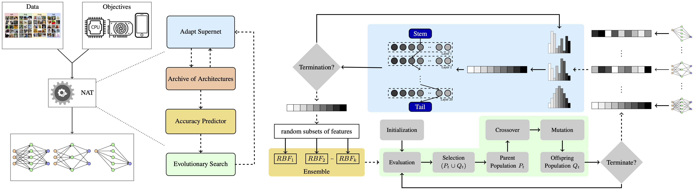
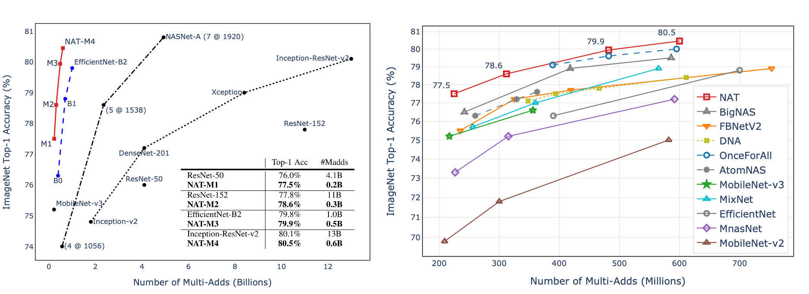
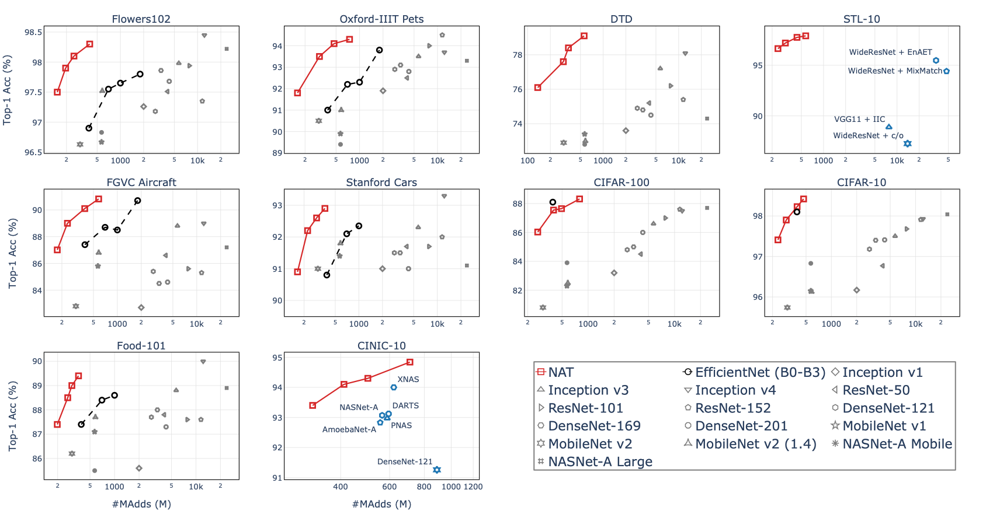
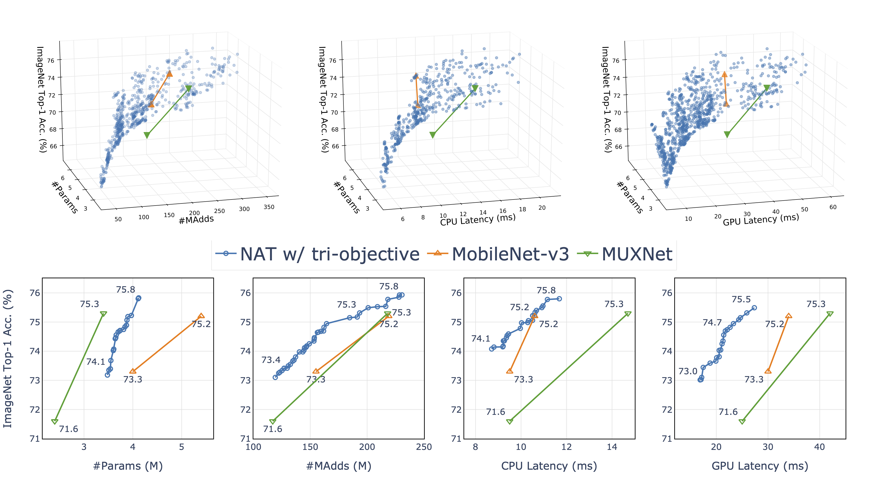
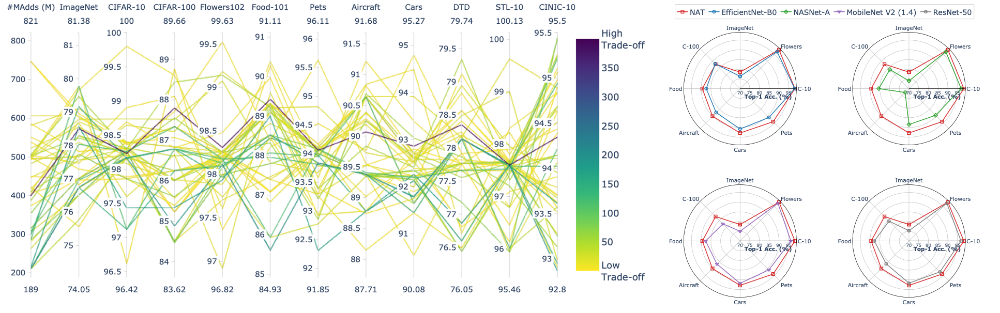
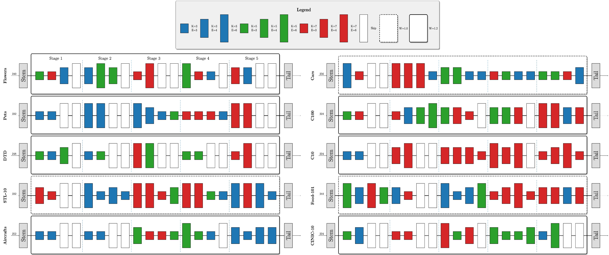

# Neural Architecture Transfer
Code accompanying the paper. 
> [Neural Architecture Transfer](https://arxiv.org/abs/2005.05859)
>
> [Zhichao Lu](https://www.zhichaolu.com), [Gautam Sreekumar](http://hal.cse.msu.edu/team/gautam-sreekumar/), [Erik Goodman](https://www.egr.msu.edu/~goodman/), [Wolfgang Banzhaf](http://www.cse.msu.edu/~banzhafw/), [Kalyanmoy Deb](https://www.egr.msu.edu/~kdeb/), and [Vishnu Boddeti](http://hal.cse.msu.edu/team/vishnu-boddeti/)
>
> *arXiv:2005.05859*


## Requirements
``` 
Python >= 3.7.x, PyTorch >= 1.4.0, timm >= 0.1.18 
```

## ImageNet Classification


``` shell
python evaluator.py --data /path/to/dataset --model subnets/imagenet/NAT-{M1,M2,M3,M4}/net.config
```

## Architecture Transfer


``` shell
python evaluator.py \
  --data /path/to/dataset \
  --dataset {aircraft,cars,cifar10,cifar100,cinic10,dtd,flowers102,food101,pets,stl10} \
  --model subnets/{dataset}/net-img@{xxx}-flops@{xxx}-top1@{xx.x}/net.config
```

## Scalability to Objectives
#### Tri-Objective

#### 12-Objective



#### Architecture Visualization


## Acknowledgement 
Codes are modified from [OnceForAll](https://github.com/mit-han-lab/once-for-all) and [pytorch-image-models](https://github.com/rwightman/pytorch-image-models) 
